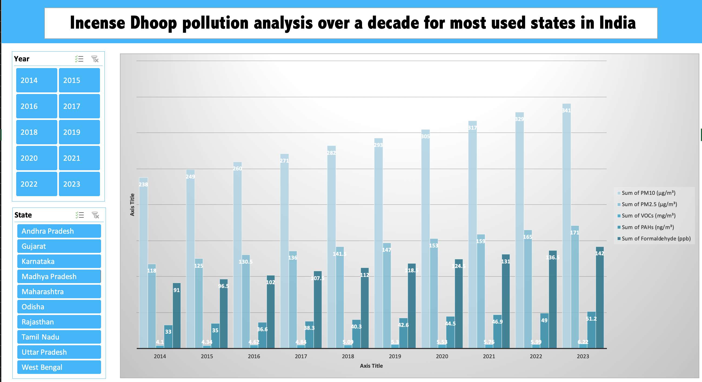

# Incense Dhoop Pollution Dashboard

## Overview

This repository contains an Excel-based dashboard designed to analyze the pollution levels associated with incense (dhoop) burning over the past decade (2014-2023) across ten major states in India. The dashboard utilizes pivot tables and slicers to provide an interactive experience, allowing users to filter data by year and state and visualize the resulting chemical emissions through bar charts.

## Features

- **Pivot Tables**: Summarize and analyze data efficiently.
- **Slicers**: Interactive filters for Year and State.
- **Bar Charts**: Visual representation of chemical pollutants based on selected filters.
- **Simple Design**: User-friendly interface for easy navigation and understanding.

## Data Columns

The dataset includes the following columns:
- Year
- State
- Particulate Matter (PM10) (μg/m³)
- Particulate Matter (PM2.5) (μg/m³)
- Volatile Organic Compounds (VOCs) (mg/m³)
- Polycyclic Aromatic Hydrocarbons (PAHs) (ng/m³)
- Formaldehyde (ppb)

## Installation

To begin using the Incense Dhoop Pollution Dashboard, follow these steps to open the Excel file:

1. **Navigate to the Excel File**:
   - Locate the directory in the repository containing `Incense_Dhoop_Pollution_Dashboard.xlsx` and download.

2. **Open the Excel File**:
   - Double-click on `Incense_Dhoop_Pollution_Dashboard.xlsx` to open it in Microsoft Excel.

Now you're ready to explore the dashboard and analyze the pollution data associated with incense burning across different states in India.

# Usage

## Creating Pivot Tables

1. **Insert Pivot Table**:
   - Select the entire dataset.
   - Go to the `Insert` tab.
   - Click on `PivotTable` and choose a new worksheet.

2. **Set Pivot Table Fields**:
   - Drag `Year` and `State` to the Rows area.
   - Drag `PM10`, `PM2.5`, `VOCs`, `PAHs`, and `Formaldehyde` to the Values area.

## Adding Slicers

1. **Insert Slicer**:
   - Select the pivot table.
   - Go to the `Analyze` tab (under PivotTable Tools).
   - Click on `Insert Slicer` and select `Year` and `State`.

2. **Position Slicers**:
   - Arrange the slicers on the dashboard for easy access and usability.

## Creating the Dashboard

1. **Design Layout**:
   - Create a new worksheet named `Dashboard`.
   - Copy the pivot table and slicers to the `Dashboard` sheet.

2. **Insert Bar Charts**:
   - Select the data range from the pivot table.
   - Go to the `Insert` tab.
   - Choose `Bar Chart` and select the desired bar chart style.

3. **Link Slicers to Bar Chart**:
   - Ensure the slicers are connected to the pivot table, so the bar chart updates based on slicer selections.

## Final Touches

1. **Adjust Design**:
   - Format the pivot table and bar charts for a clean and professional look.
   - Add titles, labels, and legends as necessary.

2. **Save the Workbook**:
   - Save the Excel file to retain all changes and dashboard settings.

## Contributing

If you have suggestions for improving this dashboard or want to add new features, feel free to open an issue or submit a pull request. Contributions are welcome!

